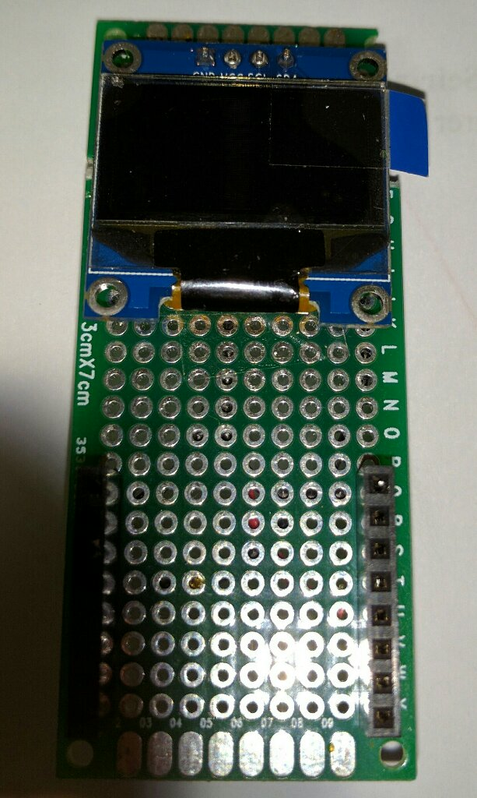

# the display shield
A shield with a small display. Handy to see more debug messages or status
information.

The mapping to GPIO-ports is like the following:
- i2c/sda
- i2c/scl (lcd)

To use this shield execute:
```python
import ulno_net_display as display
```

Here are some examples, how to use the display module
(after doing the import as described above):
```python
display.clear() # clear the display
display.println("Hello world! The text will be wrapped.")
display.print("1/n/n2/n%d"%(6*7))
display.print("345")
println()
println()
println()
println() # will scroll after line 8
set_cursor(0,3) # set the cursor
clear_line() # clear the line (and set cursor to beginning)
set_cursor(3,3)
print("Hello again")

# or you can use the follwoing to access it directly
display.text("hello",8,8) # no scrolling or wrapping here
display.pixel(7,7,True) # put a dot right next to it
display.show() # you always need to call show for the direct access to see anything
```

Here some images of the shield:




